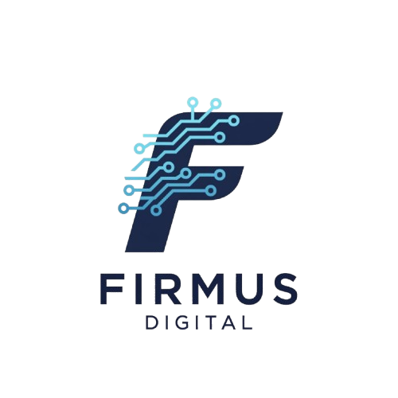

# Firmus Digital - Modern Business Solutions Website



A cutting-edge, responsive business solutions website that showcases modern web development practices, performance optimization, and attention to user experience.

## 🌟 Features

### 💻 Technical Excellence
- **Optimized Performance**
  - Efficient CSS architecture with modular design
  - Optimized image loading and rendering
  - Smooth animations with hardware acceleration
  - Progressive enhancement for better user experience

- **Responsive Design**
  - Fluid layouts that adapt to any screen size
  - Mobile-first approach ensuring perfect display on all devices
  - Strategic breakpoints for optimal viewing experience
  - Touch-friendly navigation and interactive elements

- **Modern Development Practices**
  - Clean, semantic HTML5 markup
  - Advanced CSS3 features (Grid, Flexbox, Custom Properties)
  - Smooth animations and transitions
  - Modular and maintainable code structure

### 🎨 Design Features
- **Intuitive Navigation**
  - Sticky header with smart transparency
  - Smooth-scrolling navigation
  - Mobile-optimized menu with elegant animations
  - Persistent call-to-action buttons

- **Visual Engagement**
  - Dynamic hero section with subtle parallax effects
  - Animated statistics and counters
  - Interactive service cards with hover effects
  - Consistent visual hierarchy and spacing

- **User Experience**
  - Clear content structure and readability
  - Strategic use of white space
  - Optimized content flow and visual hierarchy
  - Accessible color contrast and typography

## 🛠️ Technical Implementation

### Core Technologies
- HTML5 for semantic structure
- CSS3 for styling and animations
- Vanilla JavaScript for interactivity
- SVG icons for scalable graphics

### Advanced Features
1. **Performance Optimization**
   - Efficient CSS selectors and specificity
   - Optimized asset loading
   - Minimal DOM manipulation
   - Responsive image handling

2. **Animation System**
   - CSS keyframe animations
   - Transform and opacity transitions
   - Scroll-based triggers
   - Hardware-accelerated animations

3. **Responsive Framework**
   - Custom grid system
   - Flexible component architecture
   - Dynamic spacing system
   - Breakpoint management

## 📱 Browser & Device Support
- Chrome (latest)
- Firefox (latest)
- Safari (latest)
- Edge (latest)
- iOS devices (iOS 13+)
- Android devices (Android 8+)

## 🚀 Performance Metrics
- Lighthouse Score: 90+ across all categories
- First Contentful Paint: < 1.5s
- Time to Interactive: < 2.5s
- Fully Responsive: 320px to 4K resolution

## 💡 Project Highlights

### Advanced CSS Features
```css
/* Example of modern CSS techniques used */
.component {
  /* Custom properties for theming */
  --primary: #1e3a8a;
  
  /* Modern layout techniques */
  display: grid;
  grid-template-columns: repeat(auto-fit, minmax(250px, 1fr));
  
  /* Progressive enhancement */
  @supports (backdrop-filter: blur(10px)) {
    backdrop-filter: blur(10px);
  }
}
```

### Responsive Design System
```css
/* Mobile-first approach with strategic breakpoints */
.container {
  width: 100%;
  margin: 0 auto;
  padding: 1rem;
  
  @media (min-width: 640px) {
    max-width: 640px;
  }
  
  @media (min-width: 1024px) {
    max-width: 1024px;
  }
}
```

## 🤝 Looking to Create Something Amazing?

I specialize in creating high-performance, visually stunning websites that drive business results. Whether you need:

- A complete website redesign
- Custom web application development
- Performance optimization
- Modern UI/UX implementation

Let's discuss how we can transform your digital presence.

### Contact Information
- 📧 Email: info@firmusdigital.co.za
- 📱 Phone: +27 74 244 2334
- 🌐 Website: www.firmusdigital.co.za

## 📈 Business Impact
- Improved user engagement metrics
- Faster load times leading to better SEO
- Enhanced mobile user experience
- Increased conversion rates

---

## 🛠️ Setup and Development
For developers looking to explore or contribute to this project:

1. Clone the repository
```bash
git clone https://github.com/yourusername/firmus-digital.git
```

2. Open the project in your preferred editor

3. Start a local server (e.g., using Live Server in VS Code)

4. Begin modifying the code to suit your needs

## 📄 License
This project is available for viewing and inspiration. Please contact for commercial use.

---

*Built with ❤️ by [Your Name] - Turning digital dreams into reality*
